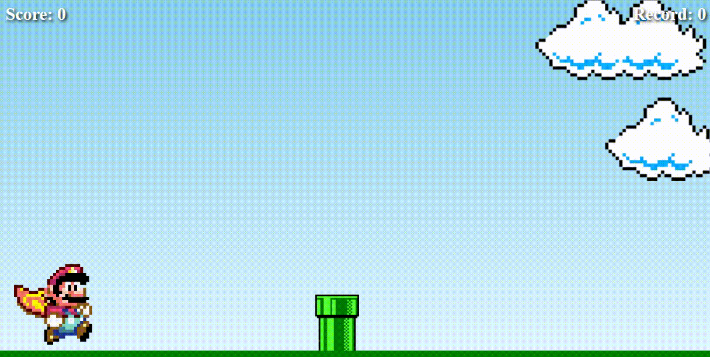

# 🕹️ Joguinho Mario Runner

Um jogo simples feito com HTML, CSS e JavaScript, inspirado no clássico Super Mario. O objetivo é desviar de obstáculos e se divertir!

## 📸 Demonstração



## 🚀 Funcionalidades

- Personagem com animação de pulo
- Obstáculo que se move automaticamente
- Detecção de colisão simples
- Reinício do jogo após colisão
- Design retro com sprites em pixel art

## 🛠️ Tecnologias usadas

- HTML5
- CSS3 (incluindo animações e transições)
- JavaScript puro (sem frameworks)

## 🎮 Como jogar

1. Clone o repositório:
   ```bash
   git clone https://github.com/seu-usuario/nome-do-repo.git
